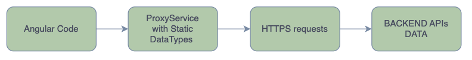

# Frontend

Angular or AngularJS

https://aspnetboilerplate.com/Pages/Documents/Zero/Startup-Template-Angular

---

# Who is this for? On the Frontend?

- Familiar with Angular or AngularJS
- Download: https://aspnetboilerplate.com/Templates
- Version 8 with:
  - Angular15+
  - NSwag 13: https://github.com/RicoSuter/NSwag
  - TypeScript 4.8
  - Jasmine 4.5

---

# Features? On the Frontend?

- Token-Based Authentication Jwt Bearer.
- Multi-Tenancy management out of the box.
- Multi-Language Support with angular localize pipe.
- Proxy Service generated by NSwag.

---

# Why do we need NSwag? in JavaScript

---

# Why do we need NSwag? in Angular

---

# Frontend Example

Example: https://aspnetboilerplate.com/Pages/Documents/Zero/Startup-Template-Angular

---

# Thank you

- Next videos:
  - Hands-on Backend using PostgreSQL, Swagger, EntityFramework.
  - Hands-on Frontend Angular and the Student Entity.
  - Automatically Generating the Backend and Frontend code.
- Like & Subscribe

---

# Links

- https://aspnetboilerplate.com/Pages/Documents/Zero/Startup-Template-Angular
- https://aspnetboilerplate.com/Templates
- https://github.com/angular/angular/releases/tag/15.2.10
- https://github.com/RicoSuter/NSwag
- https://github.com/microsoft/TypeScript/releases/tag/v4.8.4
- https://github.com/jasmine/jasmine/releases/tag/v4.5.0
