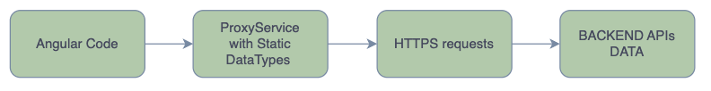
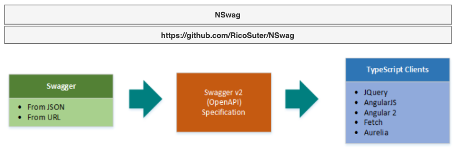

# Frontend

Angular or Vue.js or React

https://aspnetboilerplate.com/Pages/Documents/Zero/Startup-Template-Angular?searchKey=angular

---

# Students/New Programmers

- Struggle to create the new application.
- Let's Make it simple with AspnetBoilerPlate template.
- Avoid repetitive code.

---

# Best Practices

- Solid Principles
- Domain Driven Design
- Layer Architecture

---

# Talking About

1. Who is this framework for? Does it work for you?
2. Important framework features for you (Frontend).

---

# Who is this for? On the Frontend?

- Familiar with Angular or Vue.js or React
- Version 8 with:
  - Angular15+
  - NSwag 13 (https://github.com/RicoSuter/NSwag)
  - TypeScript 4.8
  - Jasmine 4.5

---

# Features? On the Frontend?

- Token-Based Authentication Jwt Bearer.
- Multi-Tenancy management out of the box.
- Multi-Language Support with L pipe.
- Proxy Service generated by NSwag.

---

# Why do we need NSwag?... brief about JavaScript application

---

# Why do we need NSwag? in Angular

---

# Thank you

- Like & Subscribe
- Next videos:
  - Hangs On Backend using PostgreSQL, Swagger, EntityFramework.
  - Hangs On Frontend Angular and the Student Entity.
  - Automatically Generating the Backend and Frontend code.

---

# Links

- https://aspnetboilerplate.com/Pages/Documents/Zero/Startup-Template-Angular?searchKey=angular
- https://github.com/RicoSuter/NSwag
